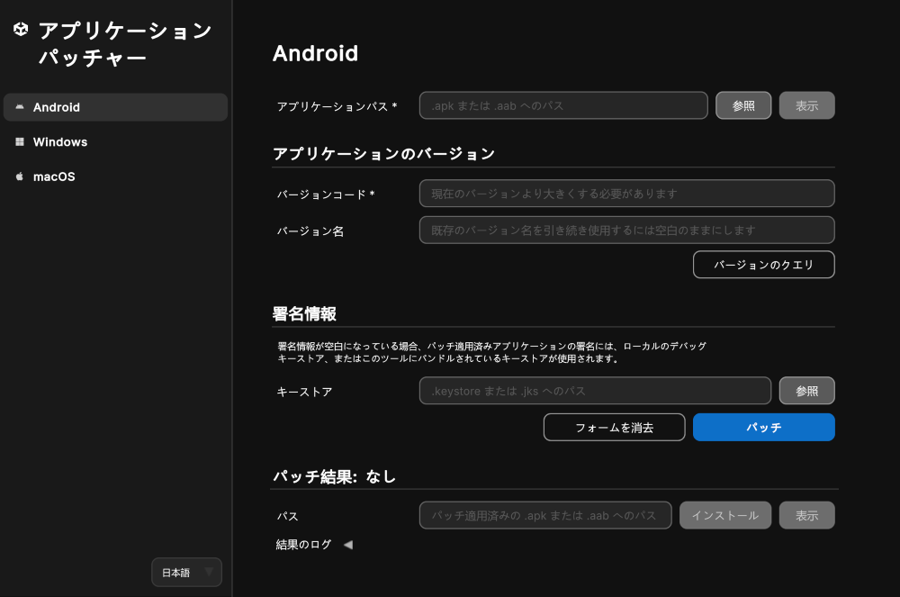
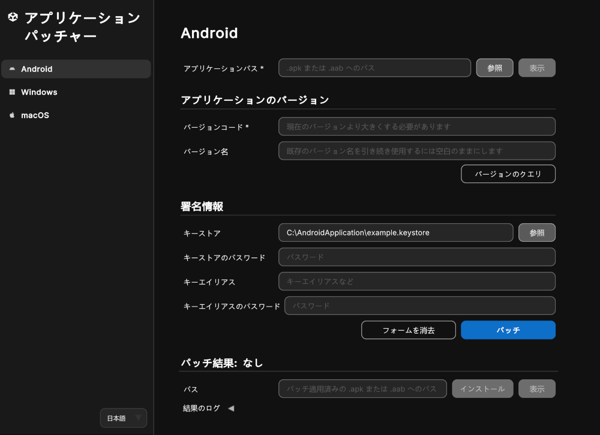
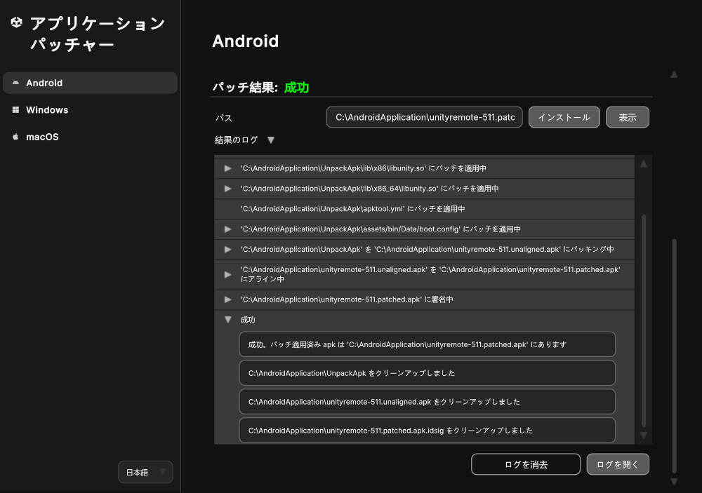
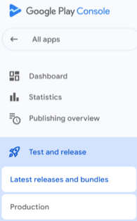
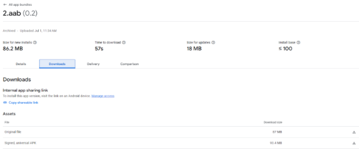
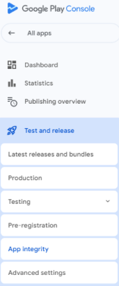
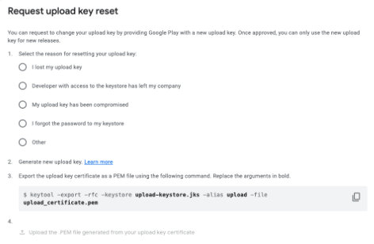
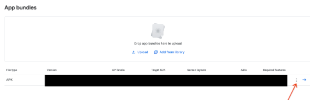

# Android アプリケーションにパッチを適用する

以下のセクションで説明するように、Unity アプリケーションパッチャーを使用して Android アプリケーションにパッチを適用できます。

| **トピック** | **説明**                                                                                        |
| :-------- |:----------------------------------------------------------------------------------------------|
| [Android アプリケーションにパッチを適用する](#patch-an-android-application-using-windows-or-mac)| Windows または Mac で Unity アプリケーションパッチャーを使用する方法を説明します。                                           |
| [コマンドラインツール](#command-line-tool-android-application-patcher)| コマンドラインツールを使用して Android アプリケーションにパッチを適用する方法を説明します。                                            |
| [アプリケーションのリターンコード](#application-return-codes)| 自動化とトラブルシューティングに役立つアプリケーションの終了コードを説明します。                                                             |
| [よくある質問](#faq)| Android アプリケーションへのパッチ適用に役立つ、よくある質問への回答を紹介します。                                                 |

<a id="patch-an-android-application-using-windows-or-mac"></a>
## Android アプリケーションにパッチを適用する (Windows または Mac を使用)

1. Windows または Mac でアプリケーションを起動します。
2. サイドバーメニューから **Android** ボタンを選択します。
3. **アプリケーションパス** フィールドで **参照** ボタンを選択します。
4. ファイルブラウザーを使用して、ターゲット `.apk` または `.aab` ファイルを探します。
5. ターゲット `.apk` または `.aab` ファイルを選択して、ファイルブラウザーウィンドウで **開く** をクリックします。
6. Android アプリケーションの APK/AAB に関連する **アプリケーションのバージョン** 情報と、**署名情報** (必要な場合) を入力します。
   1. **バージョンコード** (入力必須項目): 新しいバージョンコードを入力します。ターゲット `.apk` または `.aab` の現在のバージョンよりも大きくなければなりません。
   2. **バージョン名**: 既存のバージョン名を引き続き使用するには空白のままにします。これは任意のフィールドです。
   3. **キーストア**: **参照** ボタンを使用してこのアプリケーションの `.keystore` または `.jks` ファイルを探し、**開く** を選択します。この項目を空白のままにすることについての詳細は、 [下記の注意](#sign-patched-application) を参照してください。
   4. **キーストアのパスワード**: 選択した `.keystore` または `.jks` ファイルのパスワードを入力します。
   5. **キーエイリアス**: 選択した `.keystore` または `.jks` ファイルのキーエイリアスを入力します。
   6. **キーエイリアスのパスワード**: 指定したキーエイリアスのパスワードを入力します。
7. **パッチ** ボタンを押します。

> **注意**: **バージョンコード** フィールドと **バージョン名** フィールドは、Unity プロジェクトや Unity エディターのバージョンではなく、Android APK/AAB のバージョン情報を指しています。

> **注意**: **バージョンを確認** ボタンをクリックすると、アプリケーションの現在の **バージョンコード** と **バージョン名** を取得できます。

<a id="sign-patched-application"></a>
> **注意**: 署名情報フィールドが空白になっている場合、ローカルのデバッグキーストアファイルを利用できればそれが使用されます。ローカルのデバッグキーストアを利用できない場合は、このツールにバンドルされているキーストアが使用されます。

<br/>*Android アプリケーションにパッチを適用するためのツール*

 <br/>*キーストアフィールドに入力されている場合は、さらに多くのフィールドが表示されます。*

成功した場合、出力パスが **結果のパス** フィールドに表示されます。
   - **表示** ボタンは、パッチ適用後のアーティファクトが格納されているディレクトリを開きます。
   - **インストール** ボタンは、接続されたデバイスにパッチ適用後の `.apk` または `.aab` をインストールします。

> **注意**: 結果のパスは別のパッチを実行すると消去されます。

失敗した場合、ツール下部のログにパッチ適用プロセスとエラー発生時点の情報が表示されます。また、**結果のログ** 折りたたみ項目の下にある **ログを開く** ボタンを押すと、詳しく確認できるようにテキストファイルでアプリケーションコンソールログが開きます。

問題に対処したら、**パッチ** を押してもう一度やり直します。詳細については、[例外とログエラー](#exceptions-and-log-errors) を参照してください。

**フォームを消去** ボタンはバージョン情報と署名情報を消去し、**ログを消去** ボタンは結果のログを UI から消去します。

<br/>*パッチ適用プロセスのログから各ステップの詳細を知ることができます。一部のログは展開してさらに詳しく確認できます。*

以下の表で、ツールの各フィールドについて説明します。

| **フィールド** | **説明**|
|---|---|
| **アプリケーションパス** (入力必須項目)| パッチ適用対象の `.apk` または `.aab` のパス。|
| **バージョンコード** (入力必須項目)| Android APK/AAB のバージョンコード。ターゲットアプリケーションの現在のバージョンコードよりも大きくなければなりません。(**注意**: Unity エディターやエンジンのバージョンではありません)。|
| **バージョン名** | ユーザーに表示する Android APK/AAB のバージョン名。現在の値を引き続き使用するには空白のままにします。(**注意**: Unity エディターやエンジンのバージョンではありません)。これは任意のフィールドです。|
| **キーストア** | アプリケーションの `.keystore` または `.jks` ファイルのパス。このフィールドが空白になっている場合、ローカルのデバッグキーストアファイルを利用できればそれが使用されます。ローカルのデバッグキーストアを利用できない場合は、このツールにバンドルされているキーストアが使用されます。|
| **キーストアのパスワード** | **キーストア** フィールドで指定した当該 `.keystore` または `.jks` ファイルのパスワード。|
| **キーエイリアス** | **キーストア** フィールドで指定した当該 `.keystore` または `.jks` の一意識別子。|
| **キーエイリアスのパスワード** | **キーエイリアス** フィールドで指定した当該キーエイリアスのパスワード。|
| **結果のパス** | パッチ適用が成功した場合のパッチ適用後の `.apk` または `.aab` ファイルのパス。|
| **結果のログ** | 直近のパッチ適用試行の出力ログ。**新しくパッチ適用プロセスを行うとログは消去されます**。特定のエラーとハンドルされた例外の詳細については、[例外情報](#exceptions-and-log-errors) を参照してください。|

<a id="command-line-tool-android-application-patcher"></a>
## コマンドラインツール (Android アプリケーションパッチャー)

このツールはコマンドラインをサポートしており、`.apk` または `.aab` アプリケーションファイルを安全性の高いパッチ適用済みバージョンに変換できます。

**Windows** でのコマンドライン使用方法: 

```shell
UnityApplicationPatcherCLI -android -applicationPath <path/to/application.apk> -versionCode <code> [-verbose] [-versionName <name>] [-keystore <path/to/keystore>] [-keystorePassword <password>] [-keyAlias <alias>] [-keyAliasPassword <password>]
```

**MacOS** でのコマンドライン使用方法: 

```shell
UnityApplicationPatcher.app/Contents/MacOS/UnityApplicationPatcherCLI -android -applicationPath <path/to/application.apk> -versionCode <code> [-verbose] [-versionName <name>] [-keystore <path/to/keystore>] [-keystorePassword <password>] [-keyAlias <alias>] [-keyAliasPassword <password>]
```

> **注意**: コマンドラインの使用方法、オプション、引数の詳細を確認するには、`-help` または `-h` 引数を使用します。

> **注意**: パッチ適用プロセスのより詳細なログを確認するには `-verbose` または `-v` 引数を使用します。

<a id="application-return-codes"></a>
### アプリケーションのリターンコード

Unity アプリケーションパッチャーでは終了時に特定のリターンコードを出力してパッチ処理の結果を示します。それらのコードは特に、自動化、スクリプティング、トラブルシューティングに役立ちます。

| コード| 説明| シナリオ                                        |
|------|------------------------------------|---------------------------------------------|
| 0| 成功| パッチが正常に適用されたかヘルプコマンドが正常に実行された。              |
| 1| パッチが失敗 (汎用)| 何らかの理由でパッチ処理が失敗した。                          |
| 2| パッチが見つからなかった (失敗時)| このバイナリ用のパッチが見つからなかった。                       |
| 3| 例外のキャッチ| パッチ適用プロセス中に例外がキャッチされた。                      |
| 64| 無効なコマンドライン引数| 無効なコマンドライン引数を受け取った。上記のコマンドライン引数を参照。         |
| 183| パッチが不要 (適用済み)| パッチを適用できなかったが、成功に該当する結果であると見なされる (パッチが適用済みまたは不要)。 |

<a id="exceptions-and-log-errors"></a>
## 例外とログエラー

### Operation not permitted/Access to the path is denied

この例外は、アプリケーションによるディレクトリまたはファイルへのアクセスが拒否された場合に発生します。対処するには、システム設定を変更して、アプリケーションに権限を付与します。

Mac の場合: 
1. **System Settings**  > **Privacy & Security** に移動します。
2. **Files and Folders** までスクロールします。
3. **Unity Application Patcher** を探し、クリックして現在の権限を展開します。
4. 権限を必要なディレクトリに対して付与します。

Windows の場合: 
1. **Start** > **Settings** > **Privacy and Security** に移動します。
2. **App permissions** までスクロールします。
3. **Unity Application Patcher** に必要な設定を探します。
   * `Documents`、`File System`、またはアプリケーションのアクセスを拒否している他のディレクトリの場所にある可能性があります。
4. 権限をアプリケーションに付与します。

> **注意**: 権限またはアクセスエラーが原因でパッチの適用に失敗する場合、ターゲット `.apk` または `.aab` が格納されているディレクトリに移動して、既存のパッチ適用済みアーティファクトを削除してみてください。

### バージョンコードは既存のバージョンコードよりも大きくなければなりません。

このエラーは **バージョンコード** フィールドのバージョン番号がターゲット `.apk` または `.aab` の現在のバージョン番号以下の場合に発生します。**Version Code** フィールドの値を、ターゲット `.apk` または `.aab` の現在のバージョン番号よりも大きくなるように修正してください。

### Failed to load signer

このエラーは、パッチ適用対象のアプリケーションに署名する際に問題があると発生します。署名情報を確認し、**キーストア**、**キーストアのパスワード**、**キーエイリアス**、**キーエイリアスのパスワード** が適切に設定されていることを確認してください。

<a id="faq"></a>
## よくある質問

このセクションでは、Android アプリケーションへのパッチ適用に役立つ、よくある質問への回答を紹介します。Unity アプリケーションパッチャーを使用して Android アプリケーションにパッチを適用する方法については、上記の [Android アプリケーションにパッチを適用する](#patch-an-android-application-using-windows-or-mac) を参照してください。

Android アプリケーションへのパッチ適用に関連するよくある質問については、以下のセクションを参照してください。

1. [アプリケーションのソースや最新のビルドがありません。どのようにパッチ適用を進めたらよいですか?](#no-source)
2. [キーストアを失った場合、どうしたらよいですか?](#lost-keystore)
3. [アプリケーションを APK と OBB として公開しました。両方にパッチを適用する必要がありますか?](#apk-obb)

<a id="no-source"></a>
### 1. アプリケーションのソースや最新のビルドがありません。どのようにパッチ適用を進めたらよいですか? 

アプリケーションのソースやプロジェクトの最新のビルドがない場合、次の手順に従って [Google Play Console](https://play.google.com/console/about/) からリリース済みアプリケーションの元のファイル (AAB または APK) をダウンロードできます。

1. 開発者アカウントを使ってサインインします。
2. パッチを適用したいアプリケーションを選択します。
3. 左側のパネルで、**Test and release** > **Latest releases and bundles** の順に選択します。

    <br/>*Latest releases and bundles を選択します。*

4. 最新のリリースを選択して、**View app version** (右側の矢印) をクリックします。
5. そのウィンドウの **Downloads** タブで、最初にアップロードしたファイルにアクセスできます。

<br/>*Google Play Console の Downloads タブから最初にアップロードしたファイルにアクセスします。*

<a id="lost-keystore"></a>
### 2. キーストアを失った場合、どうしたらよいですか? 

キーストアを失った場合、次の手順に従って [Google Play Console](https://play.google.com/console/about/) からアップロードキーのリセットをリクエストできます。

1. 開発者アカウントを使ってサインインします。
2. パッチを適用したいアプリケーションを選択します。
3. 左側のパネルで、**Test and release** > **App integrity** の順に選択します。

    <br/>*Google Play Console メニューで App integrity を選択します。*

4. **Play app signing** セクションの **Settings** を選択します。
5. **Reset upload key** をクリックして Google の指示に従います。

    <br/>*キーのリセットウィンドウの Google の指示に従います。*

Google がリクエストを審査し、アップロードキーをリセットします。この処理には最大 1 週間かかる場合があります。

配布キーは Google によって保存、管理されているので、開発者はアプリケーションの新バージョンをリリースできます。既存のユーザーはアップデートとしてアプリの新バージョンを受け取ります。

<a id="apk-obb"></a>
### 3. アプリケーションを APK と OBB として公開しました。両方にパッチを適用する必要がありますか? 

アプリケーションを最初に APK と OBB として公開した場合、パッチを適用する必要があるのはアプリケーション本体 (APK) だけです。

アップデートをリリースするには、APK と OBB の組み合わせを再度アップロードするか、以前アップロードした OBB をライブラリから選択する必要があります。

APK と OBB の組み合わせをアップロードする方法: 

1. **App bundles** の下で、APK の右側にあるケバブメニューアイコンをクリックしてファイルのアップロードメニューを開きます。

    <br/>*APK の隣のケバブメニューをクリックして、ファイルアップローダーを開きます。*

2. **Upload expansion file (.obb)** を選択します。
3. **Add from Library** を押して、該当するファイルを追加します。
