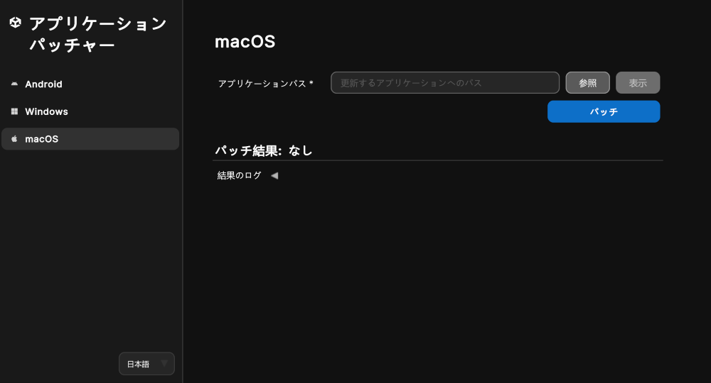

# macOS アプリケーションにパッチを適用する

以下のセクションで説明するように、Unity アプリケーションパッチャーを使用して macOS アプリケーションにパッチを適用できます。

| **トピック** | **説明**                                                   |
| :-------- |:---------------------------------------------------------|
| [macOS アプリケーションにパッチを適用する](#patch-a-macos-application-using-windows-or-mac)| Windows または Mac で Unity アプリケーションパッチャーを使用する方法を説明します。      |
| [コマンドラインツール](#command-line-tool-macos-application-patcher)| コマンドラインツールを使用して macOS アプリケーションにパッチを適用する方法を説明します。         |
| [アプリケーションのリターンコード](#application-return-codes)| 自動化とトラブルシューティングに役立つアプリケーションの終了コードを説明します。                 |
| [コード署名と公証](#code-signing-and-notarization)| アプリケーションにパッチを適用した後のコード署名と macOS アプリケーションの公証に役立つ情報を紹介します。 |

<a id="patch-a-macos-application-using-windows-or-mac"></a>
## macOS アプリケーションにパッチを適用する (Windows または Mac を使用)

1. Windows または Mac でアプリケーションを起動します。
2. サイドバーメニューから **macOS** ボタンを選択します。
3. **アプリケーションパス** フィールドに移動して **参照** ボタンを選択します。
4. ファイルブラウザーを使用して、アプリケーションバンドルを探します。例えば: `Unity.app`。専用サーバー向けアプリケーションにパッチを適用する場合は、サーバー向けアプリケーションフォルダー内の `UnityPlayer.dylib` を探してください。
5. `Unity.app` または `UnityPlayer.dylib` ファイルを選択して、ファイルブラウザーウィンドウで **開く** をクリックします。
   1. **注意: **この UI ツールを **Windows** で使用する場合、**参照** 機能がサポートするのは `UnityPlayer.dylib` ファイルだけです。それらは `myApplication.app/Conents/Frameworks/UnityPlayer.dylib` で見つけることができます。テキストフィールドにアプリケーションへの完全なパスを入力することによっても `Unity.app` にパッチを適用することができます。
6. **パッチ** ボタンを押します。

> **注意**: Unity バージョン `2018.2` 以前でビルドされた Unity アプリケーションには、個別の `UnityPlayer.dylib` は含まれていません。この場合は、アプリケーションバンドル (`.app`) を選択します。

<br/>*macOS アプリケーションにパッチを適用するためのツール*

成功した場合、ログの **パッチ結果** ヘッダーに **成功** と表示され、**結果のログ** にパッチ適用プロセスの情報が記載されます。

失敗した場合、ツール下部のログにパッチ適用プロセスとエラー発生時点の情報が表示されます。また、**結果のログ** 折りたたみ項目の下にある **ログを開く** ボタンを押すと、詳しく確認できるようにテキストファイルでアプリケーションコンソールログが開きます。

**フォームを消去** ボタンはバージョン情報と署名情報を消去し、**ログを消去** ボタンは結果のログを UI から消去します。

<a id="command-line-tool-macos-application-patcher"></a>
## コマンドラインツール (macOS アプリケーションパッチャー)

このツールはコマンドラインをサポートしており、アプリケーションの `UnityPlayer.dylib` を Unity のウェブサイトからダウンロードした安全性の高いパッチ適用済みバージョンに変換できます。

`Windows` でのコマンドライン使用方法: 

```shell
UnityApplicationPatcherCLI -macos -applicationPath <path/to/my/application.app>
UnityApplicationPatcherCLI -macos -unityPlayerLibrary <path/to/my/application.app/Contents/Frameworks/UnityPlayer.dylib>
UnityApplicationPatcherCLI -macos -unityPlayerLibrary <path/to/my/application/UnityPlayer.dylib>
UnityApplicationPatcherCLI -macos -unityPlayerLibrary <path/to/UnityPlayer.dylib> -allowStandaloneLibrary
```

`macOS` でのコマンドライン使用方法: 

```shell
UnityApplicationPatcher.app/Contents/MacOS/UnityApplicationPatcherCLI -macos -applicationPath <path/to/my/application.app>
UnityApplicationPatcher.app/Contents/MacOS/UnityApplicationPatcherCLI -macos -unityPlayerLibrary <path/to/my/application.app/Contents/Frameworks/UnityPlayer.dylib>
UnityApplicationPatcher.app/Contents/MacOS/UnityApplicationPatcherCLI -macos -unityPlayerLibrary <path/to/my/application/UnityPlayer.dylib>
UnityApplicationPatcher.app/Contents/MacOS/UnityApplicationPatcherCLI -macos -unityPlayerLibrary <path/to/UnityPlayer.dylib> -allowStandaloneLibrary
```

> **注意**: コマンドラインの使用方法、オプション、引数の詳細を確認するには、`-help` または `-h` 引数を使用します。

<a id="application-return-codes"></a>
### アプリケーションのリターンコード

Unity アプリケーションパッチャーでは終了時に特定のリターンコードを出力してパッチ処理の結果を示します。それらのコードは特に、自動化、スクリプティング、トラブルシューティングに役立ちます。

| コード| 説明| シナリオ                                       |
|------|------------------------------------|--------------------------------------------|
| 0| 成功| パッチが正常に適用されたかヘルプコマンドが正常に実行された。             |
| 1| パッチが失敗 (汎用)| 何らかの理由でパッチ処理が失敗した。                         |
| 2| パッチが見つからなかった (失敗時)| このバイナリ用のパッチが見つからなかった。                      |
| 3| 例外のキャッチ| パッチ適用プロセス中に例外がキャッチされた。                     |
| 64| 無効なコマンドライン引数| 無効なコマンドライン引数を受け取った。上記のコマンドライン引数を参照。        |
| 183| パッチが不要 (適用済み)| パッチを適用できなかったが、成功に該当する結果であると見なされる (パッチが適用済みまたは不要)。 |

<a id="code-signing-and-notarization"></a>
## コード署名と公証

パッチ適用処理を行うと、既存のコード署名が無効になります。過去にアプリケーションの署名や公証を行っていても、再び署名や公証を行う必要があります。

> **警告**: アプリケーションで以前使用した署名方法にかかわらず、パッチ適用処理ではアドホック署名が行われます。アプリケーションにパッチを適用した後は、アプリケーションへの署名方法を確認し、必要に応じて署名と公証をやり直してください。

アプリケーションの署名や公証の方法の詳細については、以下を参照してください。 

* [Code sign and notarize your macOS application](https://docs.unity3d.com/6000.3/Documentation/Manual/macos-building-notarization.html) (macOS アプリケーションのコード署名と公証) (Unity マニュアル)
* [Notarizing macOS software before distribution](https://developer.apple.com/documentation/security/notarizing-macos-software-before-distribution) (macOS ソフトウェア配布前の公証) (Apple Developer ドキュメント)
