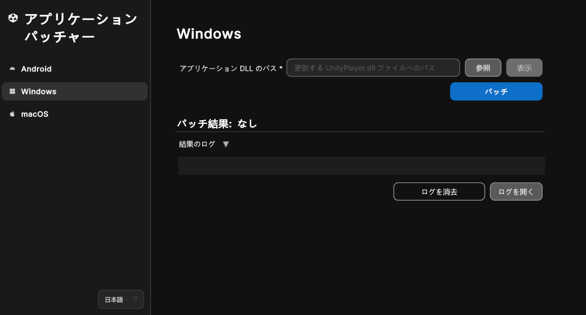

# Windows アプリケーションにパッチを適用する

以下のセクションで説明するように、Unity アプリケーションパッチャーを使用して Windows アプリケーションにパッチを適用できます。

| **トピック** | **説明**                                                                                     |
| :-------- |:-------------------------------------------------------------------------------------------|
| [Windows アプリケーションにパッチを適用する](#patch-a-windows-application-using-windows-or-mac)| Windows または Mac で Unity アプリケーションパッチャーを使用する方法を説明します。                                        |
| [コマンドラインツール](#command-line-tool-windows-application-patcher)| コマンドラインツールを使用して Windows アプリケーションにパッチを適用する方法を説明します。                                         |
| [アプリケーションのリターンコード](#application-return-codes)| 自動化とトラブルシューティングに役立つアプリケーションの終了コードを説明します。                                                          |

<a id="patch-a-windows-application-using-windows-or-mac"></a>
## Windows アプリケーションにパッチを適用する (Windows または Mac を使用)

1. Windows または Mac でアプリケーションを起動します。
2. サイドバーメニューから **Windows** ボタンを選択します。
3. **アプリケーション DLL のパス** フィールドに移動して **参照** ボタンを選択します。
4. ファイルブラウザーを使用して、ターゲットアプリケーションの `UnityPlayer.dll` ファイルを探します。
5. `UnityPlayer.dll` ファイルを選択して、ファイルブラウザーウィンドウで **開く** をクリックします。
6. **パッチ** ボタンを押します。

> **注意**: Unity バージョン 2018.2 以前でビルドされた Unity アプリケーションには、個別の `UnityPlayer.dll` は含まれていません。この場合は、アプリケーションフォルダーまたはメインの `.exe` ファイルを選択します。

> **注意**: 複数のアーキテクチャに対応したアプリケーションにパッチを適用する場合、アプリケーションフォルダーのパスを **アプリケーション DLL のパス** フィールドに貼り付けて、複数の `UnityPlayer.dll` に一括してパッチを適用できます。このための想定されるフォルダー構造は `<application/architecture/config/UnityPlayer.dll>` です

<br/>*Windows 向けアプリケーションにパッチを適用するためのツール*

成功した場合、ログの **パッチ結果** ヘッダーに **成功** と表示され、**結果のログ** にパッチ適用プロセスの情報が記載されます。

失敗した場合、ツール下部のログにパッチ適用プロセスとエラー発生時点の情報が表示されます。また、**結果のログ** 折りたたみ項目の下にある **ログを開く** ボタンを押すと、詳しく確認できるようにテキストファイルでアプリケーションコンソールログが開きます。

**フォームを消去** ボタンはバージョン情報と署名情報を消去し、**ログを消去** ボタンは結果のログを UI から消去します。

<a id="command-line-tool-windows-application-patcher"></a>
## コマンドラインツール (Windows アプリケーションパッチャー)

このツールはコマンドラインをサポートしており、アプリケーションの `UnityPlayer.dll` を Unity のウェブサイトからダウンロードした安全性の高いパッチ適用済みバージョンに変換できます。

`Windows` でのコマンドライン使用方法: 

```shell
UnityApplicationPatcherCLI -windows -unityPlayerLibrary <path/to/my/UnityPlayer.dll>
UnityApplicationPatcherCLI -windows -applicationPath <path/to/my/application>
```

`macOS` でのコマンドライン使用方法: 

```shell
UnityApplicationPatcher.app/Contents/MacOS/UnityApplicationPatcherCLI -windows -unityPlayerLibrary <path/to/my/UnityPlayer.dll>
```

> **注意**: コマンドラインの使用方法、オプション、引数の詳細を確認するには、`-help` または `-h` 引数を使用します。

<a id="application-return-codes"></a>
### アプリケーションのリターンコード

Unity アプリケーションパッチャーでは終了時に特定のリターンコードを出力してパッチ処理の結果を示します。それらのコードは特に、自動化、スクリプティング、トラブルシューティングに役立ちます。

| コード| 説明| シナリオ                                        |
|------|------------------------------------|---------------------------------------------|
| 0| 成功| パッチが正常に適用されたかヘルプコマンドが正常に実行された。              |
| 1| パッチが失敗 (汎用)| 何らかの理由でパッチ処理が失敗した。                          |
| 2| パッチが見つからなかった (失敗時)| このバイナリ用のパッチが見つからなかった。                       |
| 3| 例外のキャッチ| パッチ適用プロセス中に例外がキャッチされた。                      |
| 64| 無効なコマンドライン引数| 無効なコマンドライン引数を受け取った。上記のコマンドライン引数を参照。         |
| 183| パッチが不要 (適用済み)| パッチを適用できなかったが、成功に該当する結果であると見なされる (パッチが適用済みまたは不要)。 |
