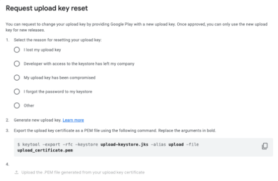

# Android 애플리케이션 패치

다음 섹션에 나와 있는 대로 Unity 애플리케이션 패치 프로그램을 사용하여 Android 애플리케이션을 패치할 수 있습니다.

| **주제** | **설명** |
| :-------- | :-------------- |
| [Android 애플리케이션 패치](#patch-an-android-application-using-windows-or-mac) | Windows나 Mac에서 Unity 애플리케이션 패치 프로그램을 사용합니다. |
| [커맨드 라인 툴](#command-line-tool-android-application-patcher) | 커맨드 라인 툴을 사용하여 Android 애플리케이션을 패치합니다. |
| [애플리케이션 반환 코드](#application-return-codes) | 자동화 및 문제 해결을 위한 애플리케이션의 종료 코드를 파악합니다. |
| [자주 묻는 질문](#faq) | Android 애플리케이션을 패치하는 데 도움이 되는 자주 묻는 질문에 대한 답변을 확인합니다. |

<a id="patch-an-android-application-using-windows-or-mac"></a>
## Android 애플리케이션 패치(Windows나 Mac 사용)

1. Windows나 Mac에서 애플리케이션을 실행합니다.
2. 사이드바 메뉴에서 **Android** 버튼을 선택합니다.
3. **애플리케이션 경로** 필드에서 **찾아보기** 버튼을 선택합니다.
4. 파일 탐색기를 사용하여 대상 `.apk` 또는 `.aab` 파일을 찾습니다.
5. 파일 탐색기 창에서 대상 `.apk` 또는 `.aab` 파일을 선택한 후 **열기**를 클릭합니다.
6. Android 애플리케이션의 APK/AAB와 관련된 **애플리케이션 버전** 정보와 **서명 정보**(필요한 경우)를 입력합니다.
   1. **버전 코드**(필수 필드):  새 버전 코드를 입력합니다. 대상 `.apk` 또는 `.aab`의 현재 버전보다 더 높은 버전이어야 합니다.
   2. **버전 이름**: 기존 버전 이름을 유지하려면 비워 둡니다. 이 필드는 선택 사항입니다.
   3. **키 저장소**: **찾아보기** 버튼을 사용하여 이 애플리케이션의 `.keystore` 또는 `.jks` 파일을 찾아서 **열기**를 클릭합니다. 이 필드를 비워 두시려면 [아래 노트](#sign-patched-application)를 참조하세요.
   4. **키 저장소 비밀번호**: 선택한 `.keystore` 또는 `.jks` 파일의 비밀번호를 입력합니다.
   5. **키 앨리어스**: 선택한 `.keystore` 또는 `.jks` 파일의 키 앨리어스를 입력합니다.
   6. **키 앨리어스 비밀번호**: 제공된 키 앨리어스의 비밀번호를 입력합니다.
7. **패치** 버튼을 누릅니다.

> **참고**: **버전 코드**와 **버전 이름** 필드는 Unity 프로젝트나 Unity 에디터 버전이 아닌 Android APK/AAB 버전 정보를 의미합니다.

> **참고**: **버전 쿼리** 버튼을 클릭하면 애플리케이션의 현재 **버전 코드**와 **버전 이름**을 확인할 수 있습니다.

<a id="sign-patched-application"></a>
> **참고**: 서명 정보 필드를 비워 두면 사용 가능한 경우 로컬 디버그 키 저장소 파일이 사용됩니다. 로컬 디버그 키 저장소를 사용할 수 없는 경우, 이 툴과 번들로 함께 제공되는 키 저장소가 사용됩니다.

<br/>*Android 애플리케이션을 패치하는 툴*

<br/>*키 저장소 필드가 생성되면 더 많은 필드가 표시됩니다.*

패치에 성공한 경우, 출력 경로가 **결과 경로** 필드에 표시됩니다.
   - **열기** 버튼은 패치된 아티팩트를 포함하는 디렉토리를 엽니다.
   - **설치** 버튼은 패치된 `.apk` 또는 `.aab`를 연결된 디바이스에 설치합니다.

> **참고**: 다른 패치가 실행될 때는 결과 경로가 지워집니다.

패치에 실패한 경우, 툴의 하단 로그에 패치 프로세스와 실패 요인에 관한 정보가 제공됩니다. 또한 **결과 로그** 폴드아웃 아래 **로그 열기** 버튼은 추가 진단을 위해 애플리케이션 콘솔 로그를 텍스트 파일로 엽니다.

문제가 해결되고 나면 **패치**를 눌러 다시 시도하세요. 자세한 내용은 [예외 및 로그 오류](#exceptions-and-log-errors)를 참조하세요.

**양식 지우기** 버튼은 버전 정보와 서명 정보를 지우고, **로그 지우기** 버튼은 UI에서 결과 로그를 지웁니다.

<br/>*패치 프로세스의 로그에 각 단계에 대한 세부 정보가 제공됩니다. 일부 로그는 펼쳐서 더 자세한 내용을 볼 수 있습니다.*

다음 테이블에 툴의 각 필드에 대한 설명이 나와 있습니다.

| **필드** | **설명**  |
|---|---|
| **애플리케이션 경로**(필수) | 패치할 `.apk` 또는 `.aab`의 경로입니다. |
| **버전 코드**(필수) | Android APK/AAB 버전 코드입니다. 대상 애플리케이션의 현재 버전 코드보다 더 큰 값이어야 합니다. (**참고**: Unity 에디터나 엔진 버전이 아닙니다.) |
| **버전 이름** | 사용자에게 표시되는 Android APK/AAB 버전 이름입니다. 현재 값을 유지하려면 비워 두세요. (**참고**: Unity 에디터나 엔진 버전이 아닙니다.) 이 필드는 선택 사항입니다. |
| **키 저장소** | 애플리케이션의 `.keystore` 또는 `.jks` 파일의 경로입니다. 이 필드를 비워 두면 사용 가능한 경우 로컬 디버그 키 저장소 파일이 사용됩니다. 로컬 디버그 키 저장소를 사용할 수 없는 경우, 이 툴과 번들로 함께 제공되는 키 저장소가 사용됩니다. |
| **키 저장소 비밀번호** | **키 저장소** 필드에 제공된 관련 `.keystore` 또는 `.jks` 파일의 비밀번호입니다. |
| **키 앨리어스** | **키 저장소** 필드에 제공된 관련 `.keystore` 또는 `.jks` 파일의 고유한 식별자입니다.  |
| **키 앨리어스 비밀번호** | **키 앨리어스** 필드에 제공된 키 앨리어스의 비밀번호입니다. |
| **결과 경로** | 패치를 성공한 경우, 패치된 `.apk` 또는 `.aab` 파일의 경로입니다. |
| **결과 로그** | 가장 최근에 시도한 패치에 대한 로그를 출력합니다. **패치 프로세스를 새로 진행하면 로그가 지워집니다**. 특정 오류와 처리된 예외에 관한 자세한 내용은 [예외 정보](#exceptions-and-log-errors)를 참조하세요. |

<a id="command-line-tool-android-application-patcher"></a>
## 커맨드 라인 툴(Android 애플리케이션 패치 프로그램)

이 툴은 `.apk` 또는 `.aab` 애플리케이션 파일을 보안이 강화된 패치된 버전으로 전환하는 커맨드 라인을 지원합니다.

**Windows**에서의 커맨드 라인 사용법:

```shell
UnityApplicationPatcherCLI -android -applicationPath <path/to/application.apk> -versionCode <code> [-verbose] [-versionName <name>] [-keystore <path/to/keystore>] [-keystorePassword <password>] [-keyAlias <alias>] [-keyAliasPassword <password>]
```

**macOS**에서의 커맨드 라인 사용법:

```shell
UnityApplicationPatcher.app/Contents/MacOS/UnityApplicationPatcherCLI -android -applicationPath <path/to/application.apk> -versionCode <code> [-verbose] [-versionName <name>] [-keystore <path/to/keystore>] [-keystorePassword <password>] [-keyAlias <alias>] [-keyAliasPassword <password>]
```

> **참고**: 커맨드 라인 사용법, 옵션, 인자에 대한 자세한 내용을 보려면 `-help` 또는 `-h` 인자를 사용하세요.

> **참고**: 패치 프로세스의 더 자세한 로그를 보려면 `-verbose` 또는 `-v` arg를 사용하세요.

<a id="application-return-codes"></a>
### 애플리케이션 반환 코드

Unity 애플리케이션 패치 프로그램은 패치 작업의 결과를 나타내는 특정 반환 코드와 함께 종료됩니다. 이러한 코드는 특히 자동화, 스크립팅 및 문제 해결에 유용합니다.

| 코드 | 설명                        | 시나리오                                                                                                      |
|------|------------------------------------|---------------------------------------------------------------------------------------------------------------|
| 0    | 성공                            | 패치가 성공적으로 적용되었거나 help 커맨드가 성공적으로 실행되었습니다.                                          |
| 1    | 패치 실패(일반)             | 패치 작업이 어떤 이유에서든 실패했습니다.                                                                        |
| 2    | 패치를 찾을 수 없음(실패 시)       | 이 바이너리에 대한 패치를 찾을 수 없습니다.                                                                 |
| 3    | 예외 발견                   | 패치 프로세스 중 예외가 발견되었습니다.                                                          |
| 64   | 잘못된 커맨드 라인 인자      | 잘못된 커맨드 라인 인자가 수신되었습니다. 위의 커맨드 라인 인자를 참고하세요.                                |
| 183  | 패치가 필요하지 않음(이미 적용됨) | 패치를 적용할 수 없으나 성공적인 결과로 간주됩니다(패치가 이미 적용되었거나 필요하지 않음). |

<a id="exceptions-and-log-errors"></a>
## 예외 및 로그 오류

### Operation not permitted/Access to the path is denied

이 예외는 애플리케이션이 디렉토리나 파일에 액세스할 수 있는 권한이 거부되었을 때 발생합니다. 이 예외를 해결하려면 시스템 설정을 변경하고 애플리케이션에 권한을 부여하세요.

Mac의 경우:
1. **System Settings** > **Privacy & Security**로 이동합니다.
2. **Files and Folders**로 스크롤합니다.
3. **Unity Application Patcher**를 찾은 다음 클릭하여 현재 권한을 확장합니다.
4. 필수 디렉토리에 권한을 부여합니다.

Windows의 경우:
1. **시작** > **설정** > **개인 정보 및 보안**으로 이동합니다.
2. **앱 사용 권한**으로 스크롤합니다.
3. **Unity Application Patcher**에 필요한 설정을 찾습니다.
   * 애플리케이션의 권한을 거부한 `문서`, `파일 시스템` 또는 기타 디렉토리 위치에 있을 수 있습니다.
4. 애플리케이션에 권한을 부여합니다.

> **참고**: 권한이나 액세스 오류로 인해 패치에 실패할 경우, 대상 `.apk` 또는 `.aab`를 포함하는 디렉토리로 이동하여 기존 패치된 아티팩트를 모두 제거하세요.

### Version code must be greater than existing version code

이 오류는 **버전 코드** 필드에 대상 `.apk` 또는 `.aab`의 현재 버전 번호보다 작거나 같은 버전 번호가 포함되어 있을 때 발생합니다. **버전 코드** 필드를 대상 `.apk` 또는 `.aab`의 현재 버전 번호보다 더 큰 값으로 수정하세요.

### Failed to load signer

이 오류는 패치된 애플리케이션을 서명하는 동안 문제가 있을 때 발생합니다. 서명 정보를 확인하고 **키 저장소**, **키 저장소 비밀번호**, **키 앨리어스**, **키 앨리어스 비밀번호**를 올바르게 설정하세요.

<a id="faq"></a>
## 자주 묻는 질문

이 섹션에서는 Android 애플리케이션을 패치하는 데 도움이 되는 자주 묻는 질문에 대한 답변을 제공합니다. Unity 애플리케이션 패치 프로그램을 사용하여 Android 애플리케이션을 패치하는 방법을 알아보려면 위의 [Android 애플리케이션 패치](#patch-an-android-application-using-windows-or-mac)를 참조하세요.

Android 애플리케이션 패치에 관해 자주 묻는 질문은 다음 섹션을 참조하세요.

1. [애플리케이션 소스나 최신 빌드가 없습니다. 패치를 어떻게 진행해야 할까요?](#no-source)
2. [키 저장소를 분실한 경우 어떻게 해야 하나요?](#lost-keystore)
3. [애플리케이션을 APK와 OBB로 퍼블리시했습니다. 둘 다 패치해야 할까요?](#apk-obb)

<a id="no-source"></a>
### 1. 애플리케이션 소스나 최신 빌드가 없습니다. 패치를 어떻게 진행해야 할까요?

애플리케이션 소스나 최신 빌드가 없을 경우, [Google Play Console](https://play.google.com/console/about/)에서 다음과 같이 릴리스된 애플리케이션의 원본 파일(AAB 또는 APK)을 다운로드할 수 있습니다.

1. 개발자 계정으로 로그인합니다.
2. 패치할 애플리케이션을 선택합니다.
3. 왼쪽 패널에서 **Test and release** > **Latest releases and bundles**를 선택합니다.

    <br/>*최신 릴리스 및 번들을 선택합니다.*

4. 최신 릴리스를 선택하고 **View app version**(오른쪽에 있는 화살표)을 클릭합니다.
5. 표시되는 창의 **Downloads** 탭에서 원래 업로드한 파일에 액세스할 수 있습니다.

<br/>*Google Play Console Downloads 탭에서 원래 업로드한 파일에 액세스합니다.*

<a id="lost-keystore"></a>
### 2. 키 저장소를 분실한 경우 어떻게 해야 하나요?

키 저장소를 분실한 경우, [Google Play Console](https://play.google.com/console/about/)에서 다음과 같이 업로드 키 재설정을 요청할 수 있습니다.

1. 개발자 계정으로 로그인합니다.
2. 패치할 애플리케이션을 선택합니다.
3. 왼쪽 패널에서 **Test and release** > **App integrity**를 선택합니다.

    <br/>*Google Play Console 메뉴에서 App integrity를 선택합니다.*

4. **Play app signing** 섹션에서 **Settings**를 선택합니다.
5. **Reset upload key**를 클릭하고 Google 지침을 따릅니다.

    <br/>*키 재설정 창에서 Google 지침을 따릅니다.*

Google은 사용자의 요청을 검토하고 업로드 키를 재설정합니다. 최대 1주가 소요될 수 있습니다.

Google에서 배포 키를 저장하고 관리함에 따라 사용자는 새 버전의 애플리케이션을 릴리스할 수 있습니다. 기존 사용자는 새 버전의 앱을 업데이트로 받게 됩니다.

<a id="apk-obb"></a>
### 3. 애플리케이션을 APK와 OBB로 퍼블리시했습니다. 둘 다 패치해야 할까요?

애플리케이션을 원래 APK와 OBB로 퍼블리시한 경우, 애플리케이션 자체(APK)만 패치하면 됩니다.

업데이트를 릴리스하려면 APK와 OBB 조합을 다시 업로드하거나 라이브러리에서 이전에 업로드한 OBB를 선택해야 합니다.

APK와 OBB 조합을 업로드하는 방법은 다음과 같습니다.

1. **App bundles**에서 APK의 오른쪽에 있는 케밥 메뉴 아이콘을 클릭하여 파일 업로드 메뉴를 엽니다.

    <br/>*APK 옆에 있는 케밥 메뉴를 클릭하여 파일 업로더를 엽니다.*

2. **Upload expansion file (.obb)**을 선택합니다.
3. **Add from Library**를 누르고 관련된 파일을 추가합니다.
