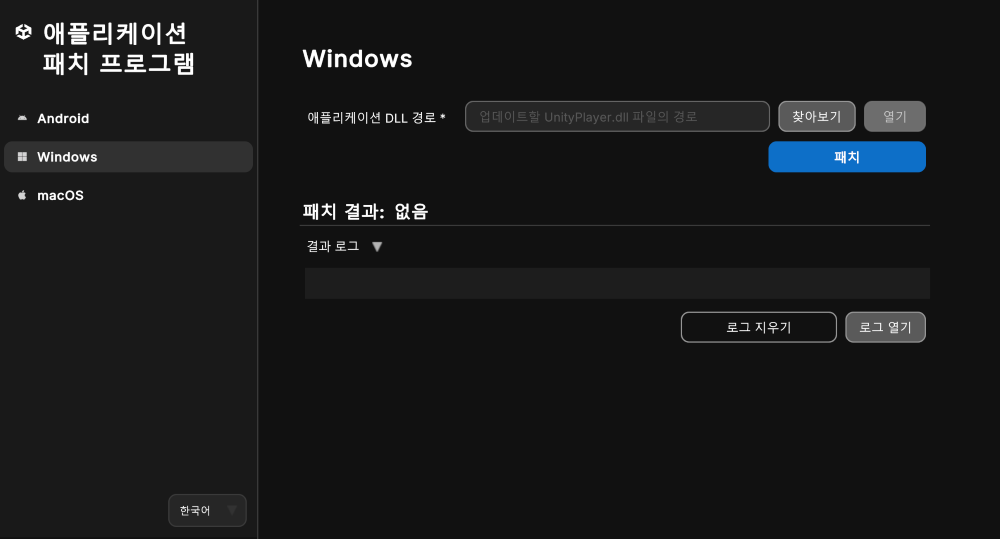

# Windows 애플리케이션 패치

다음 섹션에 나와 있는 대로 Unity 애플리케이션 패치 프로그램을 사용하여 Windows 애플리케이션을 패치할 수 있습니다.

| **주제** | **설명** |
| :-------- | :-------------- |
| [Windows 애플리케이션 패치](#patch-a-windows-application-using-windows-or-mac) | Windows나 Mac에서 Unity 애플리케이션 패치 프로그램을 사용합니다. |
| [커맨드 라인 툴](#command-line-tool-windows-application-patcher) | 커맨드 라인 툴을 사용하여 Windows 애플리케이션을 패치합니다. |
| [애플리케이션 반환 코드](#application-return-codes) | 자동화 및 문제 해결을 위한 애플리케이션의 종료 코드를 파악합니다. |

<a id="patch-a-windows-application-using-windows-or-mac"></a>
## Windows 애플리케이션 패치(Windows나 Mac 사용)

1. Windows나 Mac에서 애플리케이션을 실행합니다.
2. 사이드바 메뉴에서 **Windows** 버튼을 선택합니다.
3. **애플리케이션 DLL 경로** 필드로 이동하여 **찾아보기** 버튼을 선택합니다.
4. 파일 탐색기를 사용하여 대상 애플리케이션의 `UnityPlayer.dll` 파일을 찾습니다.
5. 파일 탐색기 창에서 `UnityPlayer.dll` 파일을 선택한 후 **열기**를 클릭합니다.
6. **패치** 버튼을 누릅니다.

> **참고**: Unity 2018.2 이하 버전으로 제작된 Unity 애플리케이션에는 별도의 `UnityPlayer.dll`이 포함되어 있지 않습니다. 이 경우에는 애플리케이션 폴더나 기본 `.exe` 파일을 선택하세요.

> **참고**: 여러 아키텍처에서 애플리케이션을 패치할 경우, 애플리케이션 폴더의 경로를 **애플리케이션 DLL 경로** 필드에 붙여 넣으면 여러 `UnityPlayer.dll`을 단일 배치로 패치할 수 있습니다. 필요한 폴더 구조는 `<application/architecture/config/UnityPlayer.dll>`입니다.

<br/>*Windows 애플리케이션을 패치하는 툴*

패치에 성공한 경우, **패치 결과** 로그 헤더에 **성공**이 표시되고, **결과 로그**에 패치 프로세스에 관한 정보가 포함됩니다.

패치에 실패한 경우, 툴의 하단 로그에 패치 프로세스와 실패 요인에 관한 정보가 제공됩니다. 또한 **결과 로그** 폴드아웃 아래 **로그 열기** 버튼은 추가 진단을 위해 애플리케이션 콘솔 로그를 텍스트 파일로 엽니다.

**양식 지우기** 버튼은 버전 정보와 서명 정보를 지우고, **로그 지우기** 버튼은 UI에서 결과 로그를 지웁니다.

<a id="command-line-tool-windows-application-patcher"></a>
## 커맨드 라인 툴(Windows 애플리케이션 패치 프로그램)

이 툴은 애플리케이션의 `UnityPlayer.dll`을 유니티 웹사이트에서 다운로드하여 보안이 강화된 패치된 버전으로 전환하는 커맨드 라인을 지원합니다.

`Windows`에서의 커맨드 라인 사용법:

```shell
UnityApplicationPatcherCLI -windows -unityPlayerLibrary <path/to/my/UnityPlayer.dll>
UnityApplicationPatcherCLI -windows -applicationPath <path/to/my/application>
```

`macOS`에서의 커맨드 라인 사용법:

```shell
UnityApplicationPatcher.app/Contents/MacOS/UnityApplicationPatcherCLI -windows -unityPlayerLibrary <path/to/my/UnityPlayer.dll>
```

> **참고**: 커맨드 라인 사용법, 옵션, 인자에 대한 자세한 내용을 보려면 `-help` 또는 `-h` 인자를 사용하세요.

<a id="application-return-codes"></a>
### 애플리케이션 반환 코드

Unity 애플리케이션 패치 프로그램은 패치 작업의 결과를 나타내는 특정 반환 코드와 함께 종료됩니다. 이러한 코드는 특히 자동화, 스크립팅 및 문제 해결에 유용합니다.

| 코드 | 설명                        | 시나리오                                                                                                      |
|------|------------------------------------|---------------------------------------------------------------------------------------------------------------|
| 0    | 성공                            | 패치가 성공적으로 적용되었거나 help 커맨드가 성공적으로 실행되었습니다.                                          |
| 1    | 패치 실패(일반)             | 패치 작업이 어떤 이유에서든 실패했습니다.                                                                        |
| 2    | 패치를 찾을 수 없음(실패 시)       | 이 바이너리에 대한 패치를 찾을 수 없습니다.                                                                 |
| 3    | 예외 발견                   | 패치 프로세스 중 예외가 발견되었습니다.                                                          |
| 64   | 잘못된 커맨드 라인 인자      | 잘못된 커맨드 라인 인자가 수신되었습니다. 위의 커맨드 라인 인자를 참고하세요.                                |
| 183  | 패치가 필요하지 않음(이미 적용됨) | 패치를 적용할 수 없으나 성공적인 결과로 간주됩니다(패치가 이미 적용되었거나 필요하지 않음). |
