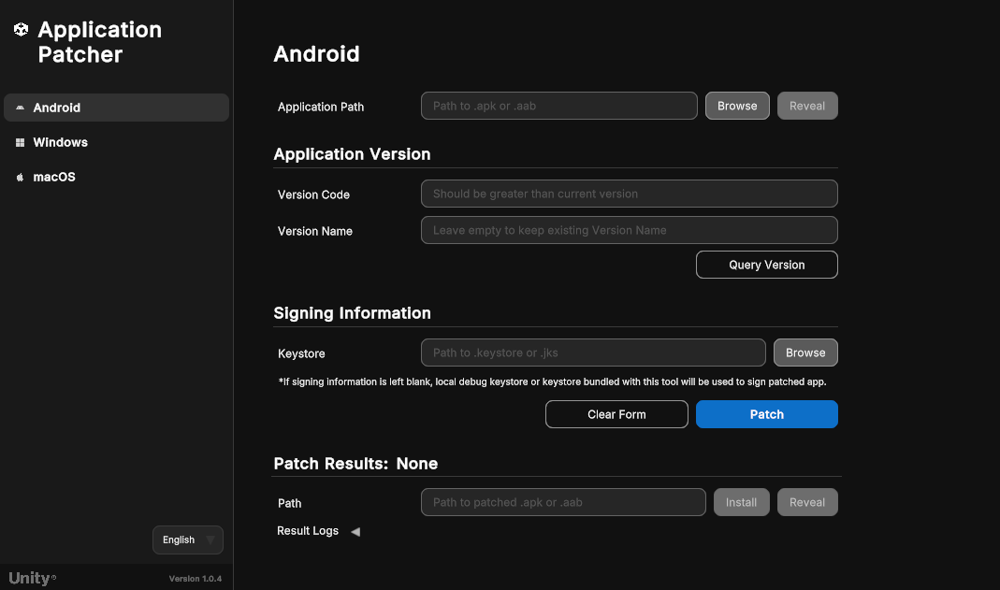
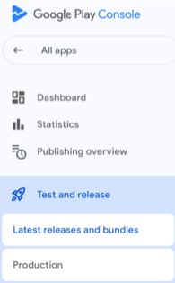
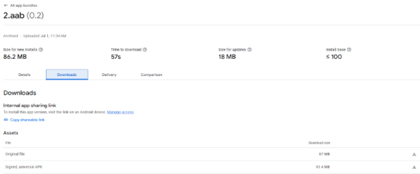
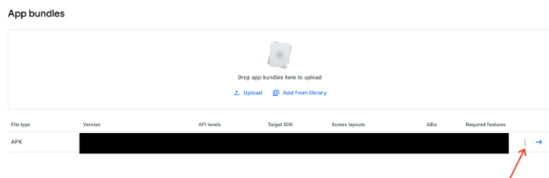

# Patch Android applications

You can use the Unity Application Patcher to patch Android applications as outlined in the following sections:

| **Topic** | **Description** |
| :-------- | :-------------- |
| [Patch an Android application](#patch-an-android-application-using-windows-or-mac) | Use the Unity Application Patcher on Windows or Mac. |
| [Command line tool](#command-line-tool-android-application-patcher) | Use the command line tool to patch Android applications. |
| [Application return codes](#application-return-codes) | Understand the application's exit codes for automation and troubleshooting. |
| [Frequently asked questions](#faq) | Get answers to frequently asked questions to help you patch your Android applications. |

<a id="patch-an-android-application-using-windows-or-mac"></a>
## Patch an Android application (using Windows or Mac)

1. Launch the application on Windows or Mac.
2. Select the **Android** button from the sidebar menu.
3. In the **Application Path** field, select the **Browse** button.
4. Use the file browser and locate the target `.apk` or `.aab` file.
5. Select the target `.apk` or `.aab` file and click **Open** on the file browser window.
6. Complete the **Application Version** information related to your Android application's APK/AAB and **Signing Information** (if necessary):
   1. **Version Code** (Required field):  Enter a new version code. This must be greater than the current version of the target `.apk` or `.aab`.
   2. **Version Name**: Leave this blank to keep the existing version name. This is an optional field.
   3. **Keystore**: Use the **Browse** button to locate the `.keystore` or `.jks` file for this application, and select **Open**. See the [note below](#sign-patched-application) for information about leaving this field empty.
   4. **Keystore Password**: Enter the password for the selected `.keystore` or `.jks` file.
   5. **Key Alias**: Enter the key alias for the selected `.keystore` or `.jks` file.
   6. **Key Alias Password**: Enter the password for the provided key alias.
7. Press the **Patch** button.

> **Note**: The **Version Code** and **Version Name** fields refer to your Android APK/AAB version information, not your Unity project or Unity Editor version.

> **Note**: You can click the **Query Version** button to acquire application's current **Version Code** and **Version Name**.

<a id="sign-patched-application"></a>
> **Note**: If the signing information fields are left blank, the local debug keystore file will be used if available. If the local debug keystore is unavailable, the keystore bundled with this tool will be used.

<br/>*Tool for patching Android applications*

<br/>*When keystore field is populated, more fields will display.*

If successful, the output path will be displayed in the **Results Path** field.
   - The **Reveal** button opens the directory containing the patched artifacts.
   - The **Install** button installs the patched `.apk` or `.aab` onto a connected device.

> **Note**: The results path will be cleared when another patch is run.

If unsuccessful, logs at the bottom of the tool provide information about the patch process and any points of failure. Additionally, the **Open Logs** button underneath the **Results Logs** foldout will open the application console logs in a text file for further inspection.

Once the issue is addressed, press **Patch** to try again. For more information, refer to [Exceptions and Log Errors](#exceptions-and-log-errors).

The **Clear Form** button will clear the version information and signing information, and the **Clear Logs** button will clear the results logs from the UI.

<br/>*The logs of the patching process provide detail about each step. Some logs can be expanded for more details.*

The following table describes each of the fields in the tool:

| **Field** | **Description**  |
|---|---|
| **Application Path** (Required) | The path to the `.apk` or `.aab` to patch. |
| **Version Code** (Required) | The Android APK/AAB version code. Must be greater than the current version code of your target application. (**Note**: Not the Unity Editor or engine version.) |
| **Version Name** | The Android APK/AAB version name shown to users. Leave blank to retain the current value. (**Note**: Not the Unity Editor or engine version.) This is an optional field. |
| **Keystore** | Path the `.keystore` or `.jks` file for your application. If this field is left blank, the local debug keystore file will be used if available. If the local debug keystore is unavailable, the keystore bundled with this tool will be used. |
| **Keystore Password** | Password for the associated `.keystore` or `.jks` file provided in the **Keystore** field. |
| **Key Alias** | Unique identifier for the associated `.keystore` or `.jks` provided in the **Keystore** field.  |
| **Key Alias Password** | Password for the provided key alias provided in the **Key Alias** field. |
| **Results Path** | The path to the patched `.apk` or `.aab` files if the patch was successful. |
| **Results Logs** | Output logs for most recent patch attempt. **Logs are cleared on new patch process**. For more details about certain errors and handled exceptions, refer to [Exception Information](#exceptions-and-log-errors). |

<a id="command-line-tool-android-application-patcher"></a>
## Command-line tool (Android Application Patcher)

This tool has command line support to convert your `.apk` or `.aab` application file to a patched version with improved security.

Command-line usage on **Windows**:

```shell
UnityApplicationPatcherCLI -android -applicationPath <path/to/application.apk> -versionCode <code> [-verbose] [-versionName <name>] [-keystore <path/to/keystore>] [-keystorePassword <password>] [-keyAlias <alias>] [-keyAliasPassword <password>]
```

Command-line usage on **MacOS**:

```shell
UnityApplicationPatcher.app/Contents/MacOS/UnityApplicationPatcherCLI -android -applicationPath <path/to/application.apk> -versionCode <code> [-verbose] [-versionName <name>] [-keystore <path/to/keystore>] [-keystorePassword <password>] [-keyAlias <alias>] [-keyAliasPassword <password>]
```

> **Note**: Use the `-help` or `-h` arg for more information on the command line usage, options, arguments.

> **Note**:se the `-verbose` or `-v` arg for a more detailed log of the patching process.

<a id="application-return-codes"></a>
### Application return codes

The Unity Application Patcher exits with specific return codes to indicate the result of its patching operation. These codes are especially useful for automation, scripting, and troubleshooting.

| Code | Description                        | Scenario                                                                                                      |
|------|------------------------------------|---------------------------------------------------------------------------------------------------------------|
| 0    | Success                            | Patch was applied successfully or help command was run successfully.                                          |
| 1    | Patch failed (generic)             | Patch operation failed for any reason.                                                                        |
| 2    | Patch not found (on failure)       | The patch for this binary could not be found.                                                                 |
| 3    | Exception caught                   | An exception was caught during the patching process.                                                          |
| 64   | Invalid command line argument      | Invalid command line argument received. Refer to command line arguments above.                                |
| 183  | Patch not needed (already applied) | Patch could not be applied but this is considered a successful outcome (patch already applied or not needed). |

<a id="exceptions-and-log-errors"></a>
## Exceptions and log errors

### Operation not permitted/Access to the path is denied

This exception occurs when the application is denied permission to access a directory or file. To address this, change your system settings and grant permission to the application.

On Mac:
1. Navigate to **System Settings** > **Privacy & Security**.
2. Scroll to **Files and Folders**.
3. Locate the **Unity Application Patcher** and click it expand its current permissions.
4. Grant permissions to the required directory.

On Windows:
1. Navigate to **Start** > **Settings** > **Privacy and Security**.
2. Scroll to **App permissions**.
3. Locate the settings needed for the **Unity Application Patcher**.
   * This is likely in `Documents`, `File System`, or some other directory location that has denied permissions to the application.
4. Grant permissions to the application.

> **Note**: If patching is failing due to a permissions or access error, try navigating to the directory that contains the target `.apk` or `.aab` and removing any existing patched artifacts.

### Version code must be greater than existing version code

This error occurs when the **Version Code** field has a version number that less than or equal to the current version number of the target `.apk` or `.aab`. Modify the **Version Code** field with a value that is greater than the current version number of the target `.apk` or `.aab`.

### Failed to load signer

This error occurs when there is an issue when signing the patched application. Check the signing information and make sure the **Keystore**, **Keystore Password**, **Key Alias**, and **Key Alias Passwords** are properly configured.

<a id="faq"></a>
## Frequently asked questions

This section provides answers to frequently asked questions to help you patch Android applications. To learn how to use the Unity Application Patcher to patch Android applications, refer to [Patch Android applications](#patch-an-android-application-using-windows-or-mac) above.

Refer to the following sections for frequently asked questions related to patching Android applications.

1. [I don’t have application sources or the latest build. How do I proceed with patching?](#no-source)
2. [What to do if my keystore is lost?](#lost-keystore)
3. [My application was published as APK and OBB. Do I need to patch both?](#apk-obb)

<a id="no-source"></a>
### 1. I don’t have application sources or the latest build. How do I proceed with patching?

If you don’t have the application sources or the latest build of your project, you can download a released application’s original files (AAB or APK) from the [Google Play Console](https://play.google.com/console/about/) as follows:

1. Sign in with your developer account.
2. Choose the application you want to patch.
3. In the panel on the left, select **Test and release** > **Latest releases and bundles**.

    <br/>*Select latest releases and bundles.*

4. Pick the latest release and click **View app version** (arrow on the right).
5. In the **Downloads** tab of that window you can access your originally uploaded file(s).

<br/>*Access originally uploaded files from the Google Play Console Downloads tab.*

<a id="lost-keystore"></a>
### 2. What to do if my keystore is lost?

If your keystore is lost, you can request an upload key reset from the [Google Play Console](https://play.google.com/console/about/) as follows:

1. Sign in with your developer account.
2. Choose the application you want to patch.
3. In the panel on the left, select **Test and release** > **App integrity**.

    <br/>*Select App integrity in the Google Play Console menu.*

4. Select **Settings** in the **Play app signing** section.
5. Click **Reset upload key** and follow Google’s instructions.

    <br/>*Follow Google's instructions in the key reset window.*

Google will review your request and reset upload key, this could take up to a week to be processed.

As the distribution key is stored and managed by Google you will be able to release a new version of your application. Existing users will receive the new version of your app as an update.

<a id="apk-obb"></a>
### 3. My application was published as APK and OBB. Do I need to patch both?

If you originally published your application as an APK and OBB, you only need to patch the application itself (APK).

To release an update you need to upload the APK and OBB combination again or choose the previously uploaded OBB from the library.

To upload an APK and OBB combination:

1. Under **App bundles**, click the kebab menu icon to the right of your APK to open the file upload menu.

    <br/>*Click the kebab menu next to your APK to open the file uploader.*

2. Select **Upload expansion file (.obb)**.
3. Press **Add from Library** and add the relevant files.
