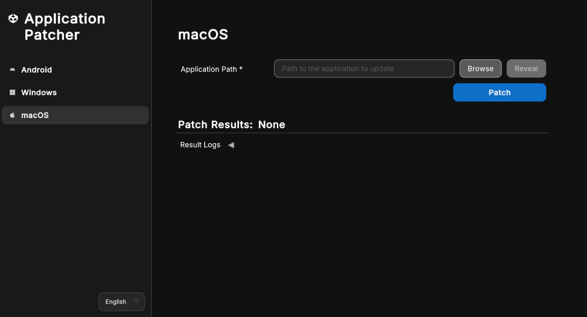

# Patch macOS applications

You can use the Unity Application Patcher to patch macOS applications as outlined in the following sections:

| **Topic** | **Description** |
| :-------- | :-------------- |
| [Patch a macOS application](#patch-a-macos-application-using-windows-or-mac) | Use the Unity Application Patcher on Windows or Mac. |
| [Command line tool](#command-line-tool-macos-application-patcher) | Use the command line tool to patch macOS applications. |
| [Application return codes](#application-return-codes) | Understand the application's exit codes for automation and troubleshooting. |
| [Code signing and notarization](#code-signing-and-notarization) | Information to help code sign and notarization a macOS application after you have patched your application. |

<a id="patch-a-macos-application-using-windows-or-mac"></a>
## Patch a macOS application (using Windows or Mac)

1. Launch the application on Windows or Mac.
2. Select the **macOS** button from the sidebar menu.
3. Navigate to the **Application Path** field and select the **Browse** button.
4. Use the file browser and locate your application bundle. For example: `Unity.app`. If you are patching a dedicated server application locate `UnityPlayer.dylib` within your server application folder.
5. Select `Unity.app` or `UnityPlayer.dylib` file and click **Open** on the file browser window.
   1. **Note:** When using this UI tool on **Windows**, the **Browse** functionality only supports `UnityPlayer.dylib` files. They can be found at `myApplication.app/Conents/Frameworks/UnityPlayer.dylib`. You can also patch a `Unity.app` by entering the full path to the application into the text field.
6. Press the **Patch** button.

> **Note**: Unity applications built with Unity versions `2018.2` and earlier do not contain a separate `UnityPlayer.dylib`. Please select the application bundle (`.app`) in this case.

<br/>*Tool for patching macOS applications.*

If successful, the logs **Patch Results** header will display **Success** and the **Results Logs** will contain information about the patch process.

If unsuccessful, logs at the bottom of the tool provide information about the patch process and any points of failure. Additionally, the **Open Logs** button underneath the **Results Logs** foldout will open the application console logs in a text file for further inspection.

The **Clear Form** button will clear the version information and signing information, and the **Clear Logs** button will clear the results logs from the UI.

<a id="command-line-tool-macos-application-patcher"></a>
## Command-line Tool (macOS Application Patcher)

This tool has command line support to convert your application's `UnityPlayer.dylib` to a patched version with improved security downloaded from the Unity website.

Command-line usage on `Windows`:

```shell
UnityApplicationPatcherCLI -macos -applicationPath <path/to/my/application.app>
UnityApplicationPatcherCLI -macos -unityPlayerLibrary <path/to/my/application.app/Contents/Frameworks/UnityPlayer.dylib>
UnityApplicationPatcherCLI -macos -unityPlayerLibrary <path/to/my/application/UnityPlayer.dylib>
UnityApplicationPatcherCLI -macos -unityPlayerLibrary <path/to/UnityPlayer.dylib> -allowStandaloneLibrary
```

Command-line usage on `macOS`:

```shell
UnityApplicationPatcher.app/Contents/MacOS/UnityApplicationPatcherCLI -macos -applicationPath <path/to/my/application.app>
UnityApplicationPatcher.app/Contents/MacOS/UnityApplicationPatcherCLI -macos -unityPlayerLibrary <path/to/my/application.app/Contents/Frameworks/UnityPlayer.dylib>
UnityApplicationPatcher.app/Contents/MacOS/UnityApplicationPatcherCLI -macos -unityPlayerLibrary <path/to/my/application/UnityPlayer.dylib>
UnityApplicationPatcher.app/Contents/MacOS/UnityApplicationPatcherCLI -macos -unityPlayerLibrary <path/to/UnityPlayer.dylib> -allowStandaloneLibrary
```

> **Note**: Use the `-help` or `-h` arg for more information on the command line usage, options, arguments.

<a id="application-return-codes"></a>
### Application return codes

The Unity Application Patcher exits with specific return codes to indicate the result of its patching operation. These codes are especially useful for automation, scripting, and troubleshooting.

| Code | Description                        | Scenario                                                                                                      |
|------|------------------------------------|---------------------------------------------------------------------------------------------------------------|
| 0    | Success                            | Patch was applied successfully or help command was run successfully.                                          |
| 1    | Patch failed (generic)             | Patch operation failed for any reason.                                                                        |
| 2    | Patch not found (on failure)       | The patch for this binary could not be found.                                                                 |
| 3    | Exception caught                   | An exception was caught during the patching process.                                                          |
| 64   | Invalid command line argument      | Invalid command line argument received. Refer to command line arguments above.                                |
| 183  | Patch not needed (already applied) | Patch could not be applied but this is considered a successful outcome (patch already applied or not needed). |

<a id="code-signing-and-notarization"></a>
## Code signing and notarization

The patching process invalidates any existing code signatures. If your application was previously signed and/or notarized, you need to sign and/or notarize it again.

> **Warning**: The patching process will leave the application ad-hoc signed regardless of how you signed it before. After you have patched your application, check how your application is signed and ensure you sign and notarize it again if needed.

For more information about how to sign and/or notarize your application refer to:

* [Code sign and notarize your macOS application](https://docs.unity3d.com/6000.3/Documentation/Manual/macos-building-notarization.html) (Unity Manual)
* [Notarizing macOS software before distribution](https://developer.apple.com/documentation/security/notarizing-macos-software-before-distribution) (Apple Developer Documentation)
