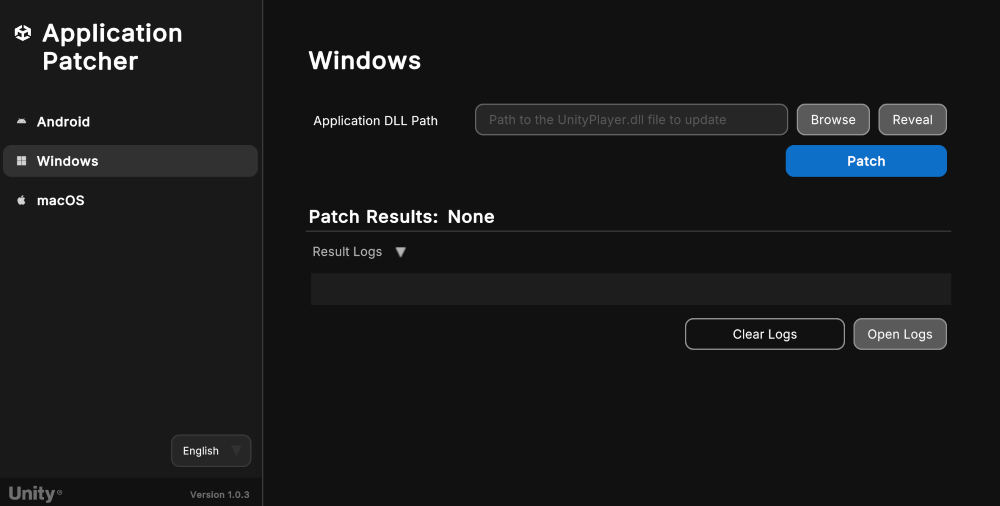

# Patch Windows applications

You can use the Unity Application Patcher to patch Windows applications as outlined in the following sections:

| **Topic** | **Description** |
| :-------- | :-------------- |
| [Patch a Windows application](#patch-a-windows-application-using-windows-or-mac) | Use the Unity Application Patcher on Windows or Mac. |
| [Command line tool](#command-line-tool-windows-application-patcher) | Use the command line tool to patch Windows applications. |
| [Application return codes](#application-return-codes) | Understand the application's exit codes for automation and troubleshooting. |

<a id="patch-a-windows-application-using-windows-or-mac"></a>
## Patch a Windows application (using Windows or Mac)

1. Launch the application on Windows or Mac.
2. Select the **Windows** button from the sidebar menu.
3. Navigate to the **Application DLL Path** field and select the **Browse** button.
4. Use the file browser and locate the `UnityPlayer.dll` file of the target application.
5. Select `UnityPlayer.dll` file and click **Open** on the file browser window.
6. Press the **Patch** button.

> **Note**: Unity applications built with Unity versions 2018.2 and earlier do not contain a separate `UnityPlayer.dll`. Please select the application folder or the main `.exe` file in this case.

> **Note**: When patching an application with multiple architectures, the path to the application folder can be pasted into the **Application DLL Path** field and multiple `UnityPlayer.dll` can be patched in one batch. The expected folder structure for this is `<application/architecture/config/UnityPlayer.dll>`

<br/>*Tool for patching Windows applications*

If successful, the logs **Patch Results** header will display **Success** and the **Results Logs** will contain information about the patch process.

If unsuccessful, logs at the bottom of the tool provide information about the patch process and any points of failure. Additionally, the **Open Logs** button underneath the **Results Logs** foldout will open the application console logs in a text file for further inspection.

The **Clear Form** button will clear the version information and signing information, and the **Clear Logs** button will clear the results logs from the UI.

<a id="command-line-tool-windows-application-patcher"></a>
## Command-line Tool (Windows Application Patcher)

This tool has command line support to convert your application's `UnityPlayer.dll` to a patched version with improved security downloaded from the Unity website.

Command-line usage on `Windows`:

```shell
UnityApplicationPatcherCLI -windows -unityPlayerLibrary <path/to/my/UnityPlayer.dll>
UnityApplicationPatcherCLI -windows -applicationPath <path/to/my/application>
```

Command-line usage on `macOS`:

```shell
UnityApplicationPatcher.app/Contents/MacOS/UnityApplicationPatcherCLI -windows -unityPlayerLibrary <path/to/my/UnityPlayer.dll>
```

> **Note**: Use the `-help` or `-h` arg for more information on the command line usage, options, arguments.

<a id="application-return-codes"></a>
### Application return codes

The Unity Application Patcher exits with specific return codes to indicate the result of its patching operation. These codes are especially useful for automation, scripting, and troubleshooting.

| Code | Description                        | Scenario                                                                                                      |
|------|------------------------------------|---------------------------------------------------------------------------------------------------------------|
| 0    | Success                            | Patch was applied successfully or help command was run successfully.                                          |
| 1    | Patch failed (generic)             | Patch operation failed for any reason.                                                                        |
| 2    | Patch not found (on failure)       | The patch for this binary could not be found.                                                                 |
| 3    | Exception caught                   | An exception was caught during the patching process.                                                          |
| 64   | Invalid command line argument      | Invalid command line argument received. Refer to command line arguments above.                                |
| 183  | Patch not needed (already applied) | Patch could not be applied but this is considered a successful outcome (patch already applied or not needed). |
