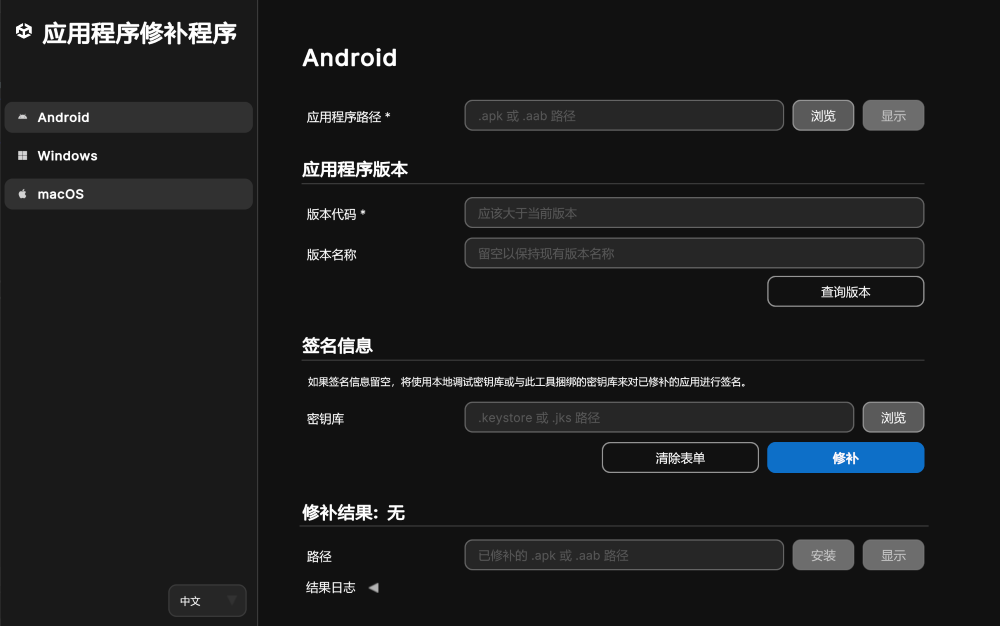
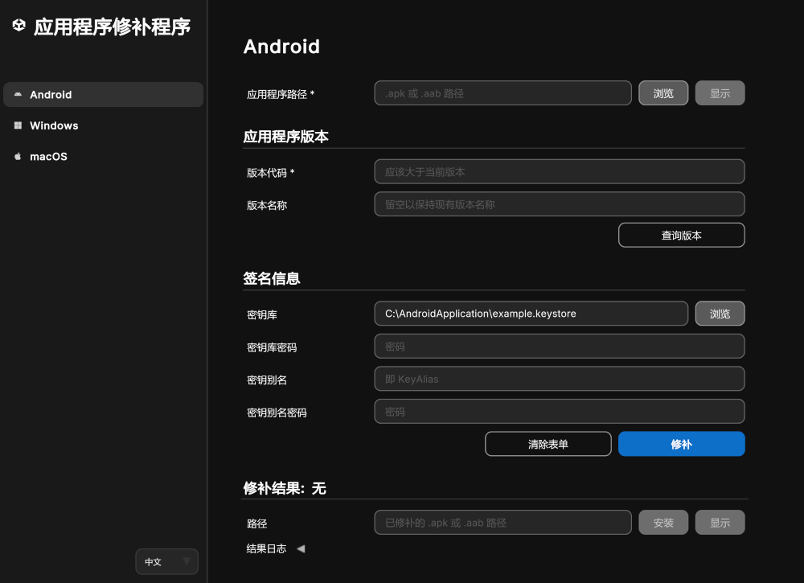
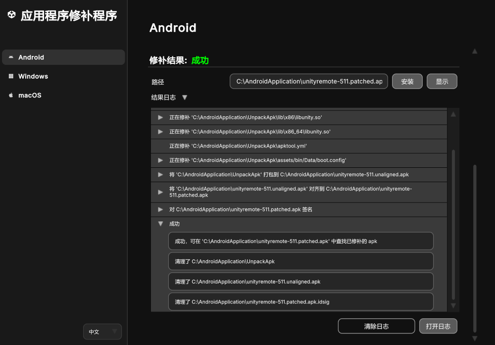

# 修补 Android 应用程序

您可以使用 Unity 应用程序修补程序来修补 Android 应用程序，如以下几节所述：

| **主题** | **描述** |
| :-------- | :-------------- |
| [修补 Android 应用程序](#patch-an-android-application-using-windows-or-mac)| 在 Windows 或 Mac 上使用 Unity 应用程序修补程序。|
| [命令行工具](#command-line-tool-android-application-patcher)| 使用命令行工具修补 Android 应用程序。|
| [应用程序返回代码](#application-return-codes)| 了解应用程序的退出代码，以便执行自动化流程和故障排除。|
| [常见问题解答](#faq)| 获取常见问题解答，以帮助您修补 Android 应用程序。|

<a id="patch-an-android-application-using-windows-or-mac"></a>
## 修补 Android 应用程序（使用 Windows 或 Mac）

1. 在 Windows 或 Mac 上启动应用程序。
2. 从侧边栏菜单中选择 **Android** 按钮。
3. 在**应用程序路径**栏，选择**浏览**按钮。
4. 使用文件浏览器找到目标 `.apk` 或 `.aab` 文件。
5. 选择目标 `.apk` 或 `.aab` 文件并在文件浏览器窗口中点击**打开**。
6. 填写与您的 Android 应用程序的 APK/AAB 文件相关的**应用程序版本**信息，以及（如有必要）填写**签名信息**：
   1. **版本代码**（必填栏）：输入新的版本代码。该代码必须大于目标 `.apk` 或 `.aab` 的当前版本。
   2. **版本名称**：留空将保持现有版本名称。这是可选栏。
   3. **密钥库**：使用**浏览**按钮找到此应用程序所需的 `.keystore` 或 `.jks` 文件，并选择**打开**。请参阅[以下注意事项](#sign-patched-application)，了解将此栏留空时的信息。
   4. **密钥库密码**：输入选定`.keystore` 或 `.jks` 文件的密码。
   5. **密钥别名**：输入选定`.keystore` 或 `.jks` 文件的密钥别名。
   6. **密钥别名密码**：输入提供的密钥别名的密码。
7. 按**修补**按钮。

> **注意**：**版本代码**和**版本名称**栏指的是 Android APK/AAB 版本信息，而不是 Unity 项目或 Unity 编辑器版本。

> **注意**：您可以点击**查询版本**按钮获取应用程序当前的**版本代码**和**版本名称**。

<a id="sign-patched-application"></a>
> **注意**：如果签名信息栏留空，将使用本地调试密钥库文件（如有）。如果本地调试密钥库不可用，将使用与此工具捆绑的密钥库。

<br/>*用于修补 Android 应用程序的工具*

<br/>*填充密钥库栏后，将显示更多栏。*

如果成功，输出路径将显示在**结果路径**栏。
   - **显示**按钮会打开包含已修补的 Artifact 的目录。
   - **安装**按钮将已修补的 `.apk` 或 `.aab` 安装到连接设备上。

> **注意**：当运行另一个补丁时，结果路径将被清除。

如果不成功，工具底部的日志会提供有关修补过程和任何失败点的信息。此外，**结果日志**折叠箭头下的**打开日志**按钮，将在文本文件中打开应用程序控制台日志以供进一步检查。

解决问题后，请按**修补**以重试。有关更多信息，请参阅[异常和日志错误](#exceptions-and-log-errors)。

**清除表单**按钮将清除版本信息和签名信息，而**清除日志**按钮将从 UI 清除结果日志。

<br/>* 修补过程日志提供关于每个步骤的详细信息。一些日志可以展开以显示更多详细信息。*

下表描述了此工具中的每个栏：

| **栏** | **描述**|
|---|---|
| **应用程序路径**（必填）| 要修补的 `.apk` 或 `.aab` 的路径。|
| **版本代码**（必填）| Android APK/AAB 版本代码。必须大于目标应用程序的当前版本代码。（**注意**：不是 Unity 编辑器或引擎版本。）|
| **版本名称** | 向用户显示的 Android APK/AAB 版本名称。留空以保留当前值。（**注意**：不是 Unity 编辑器或引擎版本。）这是可选栏。|
| **密钥库** | 应用程序的 `.keystore` 或 `.jks` 文件路径。如果此栏留空，将使用本地调试密钥库文件（如有）。如果本地调试密钥库不可用，将使用与此工具捆绑的密钥库。|
| **密钥库密码** | 在**密钥库**栏中提供的关联 `.keystore` 或 `.jks` 文件的密码。|
| **密钥别名** | 在**密钥库**栏中提供的关联 `.keystore` 或 `.jks` 文件的唯一标识符。|
| **密钥别名密码** | 在**密钥别名**栏中提供的密钥别名的密码。|
| **结果路径** | 修补成功后，已修补的 `.apk` 或 `.aab` 文件的路径。|
| **结果日志** | 最近一次修补尝试的输出日志。**新的修补过程开始时，日志会被清除**。有关某些错误和经处理的异常的更多详细信息，请参阅[异常信息](#exceptions-and-log-errors)。|

<a id="command-line-tool-android-application-patcher"></a>
## 命令行工具（Android 应用程序修补程序）

该工具支持命令行操作，可以将您的 `.apk` 或 `.aab` 应用程序文件转换成安全性更高的修补版本。

在 **Windows** 上使用命令行：

```shell
UnityApplicationPatcherCLI -android -applicationPath <path/to/application.apk> -versionCode <code> [-verbose] [-versionName <name>] [-keystore <path/to/keystore>] [-keystorePassword <password>] [-keyAlias <alias>] [-keyAliasPassword <password>]
```

在 **MacOS** 上使用命令行：

```shell
UnityApplicationPatcher.app/Contents/MacOS/UnityApplicationPatcherCLI -android -applicationPath <path/to/application.apk> -versionCode <code> [-verbose] [-versionName <name>] [-keystore <path/to/keystore>] [-keystorePassword <password>] [-keyAlias <alias>] [-keyAliasPassword <password>]
```

> **注意**：使用 `-help` 或 `-h` 参数获取有关命令行用法、选项和参数的更多信息。

> **注意**：使用 `-verbose` 或 `-v` 参数获取更详细的修补过程日志。

<a id="application-return-codes"></a>
### 应用程序返回代码

Unity 应用程序修补程序退出时返回指定的代码，以指示其修补操作结果。这些代码对于自动化、脚本编写和故障排除特别有用。

| 代码| 描述| 场景|
|------|------------------------------------|---------------------------------------------------------------------------------------------------------------|
| 0| 成功| 已成功应用补丁或已成功运行 help 命令。|
| 1| 修补失败（通用）| 修补操作因故失败。|
| 2| 未找到补丁（失败）| 未找到该二进制文件的补丁。|
| 3| 捕获异常| 修补过程中捕获到异常。|
| 64| 命令行参数无效| 收到无效的命令行参数。请参阅上面的命令行参数。|
| 183| 不需要补丁（已应用）| 无法应用补丁，但被视为成功结果（已应用或不需要补丁）。|

<a id="exceptions-and-log-errors"></a>
## 异常和日志错误

### 操作未获许可/路径访问被拒

当应用程序被拒绝访问某个目录或文件时，会发生此异常。为了解决这个问题，请更改系统设置并授予应用程序相应权限。

在 Mac 上：
1. 导航到**系统设置** > **隐私与安全性**。
2. 滚动到**文件与文件夹**。
3. 找到并点击 **Unity 应用程序修补程序**以展开其当前权限。
4. 授予所需目录的权限。

在 Windows 上：
1. 导航到**开始** > **设置** > **隐私和安全性**。
2. 滚动到**应用权限**。
3. 找到 **Unity 应用程序修补程序**所需的设置。
   * 这可能位于 `Documents`、`File System` 或其他拒绝应用程序权限的目录位置。
4. 授予应用程序权限。

> **注意**：如果修补因权限或访问错误而失败，请尝试导航到包含目标 `.apk` 或 `.aab` 的目录，并移除任何现有的已修补 Artifact。

### 版本代码必须大于现有版本代码

当**版本代码**栏中的版本号小于或等于目标 `.apk` 或 `.aab` 的当前版本号时，会发生此错误。将**版本代码**栏中的值修改成大于目标 `.apk` 或 `.aab` 的当前版本号。

### 签名工具加载失败

如果签署已修补的应用程序时出现问题，会发生此错误。检查签名信息，确保**密钥库**、**密钥库密码**、**密钥别名**和**密钥别名密码**已正确配置。

<a id="faq"></a>
## 常见问题解答

本节提供常见问题解答，以帮助您修补 Android 应用程序。要了解如何使用 Unity 应用程序修补程序来修补 Android 应用程序，请参阅上面的[修补 Android 应用程序](#patch-an-android-application-using-windows-or-mac)。

关于修补 Android 应用程序相关的常见问题解答，请参阅以下几节。

1. [我没有应用程序源代码或最新编译版本。该如何进行修补？](#no-source)
2. [如果我的密钥库丢失了怎么办？](#lost-keystore)
3. [我的应用程序以 APK 和 OBB 形式发布。我需要同时修补这两个吗？](#apk-obb)

<a id="no-source"></a>
### 1. 我没有应用程序源代码或最新编译版本。该如何进行修补？

如果您没有应用程序源代码或项目的最新编译版本，可以从 [Google Play 管理中心](https://play.google.com/console/about/) 下载已发布应用程序的原始文件（AAB 或 APK），具体步骤如下：

1. 使用您的开发者帐户登录。
2. 选择要修补的应用程序。
3. 在左侧面板中，选择**测试和发布** > **最新版本和 app bundle**。

    <br/>*选择“最新版本和 app bundle”。*

4. 选取最新版本并点击**查看应用版本**（右侧箭头）。
5. 在该窗口中的**下载**选项卡，您可以访问最初上传的文件。

<br/>*通过 Google Play 管理中心“下载”选项卡访问最初上传的文件。*

<a id="lost-keystore"></a>
### 2. 如果我的密钥库丢失了怎么办？

如果您的密钥库丢失了，可以按照以下步骤从 [Google Play 管理中心](https://play.google.com/console/about/) 请求重置上传密钥：

1. 使用您的开发者帐户登录。
2. 选择要修补的应用程序。
3. 在左侧面板中，选择**测试和发布** > **应用完整性**。

    <br/>*在 Google Play 管理中心菜单中选择“应用完整性”。*

4. 在 **Play 应用签名**部分选择**设置**。
5. 点击**重置上传密钥**并按照 Google 的指示操作。

    <br/>*按照密钥重置窗口中的 Google 指示进行操作。*

Google 会审核您的请求并重置上传密钥，这个过程可能需要一周时间。

由于分发密匙由 Google 存储和管理，您将能够发布应用程序的新版本。现有用户将会以更新的形式接收应用的新版本。

<a id="apk-obb"></a>
### 3. 我的应用程序以 APK 和 OBB 形式发布。我需要同时修补这两个吗？

如果您的应用程序最初以 APK 和 OBB 形式发布，只需修补应用程序本身 (APK) 即可。

要发布更新，您需要再次上传 APK 与 OBB 的组合或者从资源库中选择之前已上传过的 OBB 文件。

要上传 APK 与 OBB 的组合：

1. 在 **App bundle** 下，点击您的 APK 右侧的竖三点菜单图标来打开文件上传菜单。

    <br/>*点击您的 APK 旁边的竖三点菜单来打开文件上传工具。*

2. 选择**上传扩展文件 (.obb)**。
3. 按**从库中添加**并添加相关文件。
