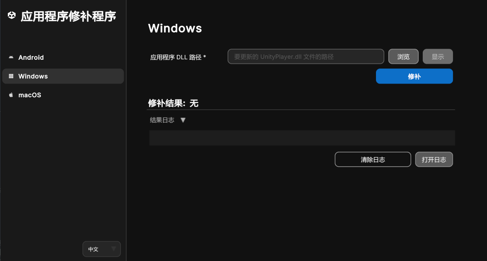

#修补 Windows 应用程序

您可以使用 Unity 应用程序修补程序来修补 Windows 应用程序，如以下几节所述：

| **主题** | **描述** |
| :-------- | :-------------- |
| [修补 Windows 应用程序](#patch-a-windows-application-using-windows-or-mac)| 在 Windows 或 Mac 上使用 Unity 应用程序修补程序。|
| [命令行工具](#command-line-tool-windows-application-patcher)| 使用命令行工具修补 Windows 应用程序。|
| [应用程序返回代码](#application-return-codes)| 了解应用程序的退出代码，以便执行自动化流程和故障排除。|

<a id="patch-a-windows-application-using-windows-or-mac"></a>
## 修补 Windows 应用程序（使用 Windows 或 Mac）

1. 在 Windows 或 Mac 上启动应用程序。
2. 从侧边栏菜单中选择 **Windows** 按钮。
3. 导航到**应用程序 DLL 路径**栏，并选择**浏览**按钮。
4. 使用文件浏览器找到目标应用程序的 `UnityPlayer.dll` 文件。
5. 选择 `UnityPlayer.dll` 文件并在文件浏览器窗口中点击**打开**。
6. 按**修补**按钮。

> **注意**：使用 Unity 版本 2018.2 及更低版本构建的 Unity 应用程序不包含单独的 `UnityPlayer.dll`。在这种情况下，请选择应用程序文件夹或 `.exe` 主文件。

> **注意**：修补具有多个架构的应用程序时，可以将应用程序文件夹的路径粘贴到**应用程序 DLL 路径**栏中，并且可以批量修补多个 `UnityPlayer.dll`。这种情况下的文件夹结构应该为 `<application/architecture/config/UnityPlayer.dll>`

<br/>*用于修补 Windows 应用程序的工具*

如果成功，日志中的**修补结果**标头将显示**成功**，并且**结果日志**将包含有关修补过程的信息。

如果不成功，工具底部的日志会提供有关修补过程和任何失败点的信息。此外，**结果日志**折叠箭头下的**打开日志**按钮，将在文本文件中打开应用程序控制台日志以供进一步检查。

**清除表单**按钮将清除版本信息和签名信息，而**清除日志**按钮将从 UI 清除结果日志。

<a id="command-line-tool-windows-application-patcher"></a>
## 命令行工具（Windows 应用程序修补程序）

该工具支持命令行操作，可以将您应用程序的 `UnityPlayer.dll` 转换成从 Unity 网站下载的安全性更高的修补版本。

在 `Windows` 上使用命令行：

```shell
UnityApplicationPatcherCLI -windows -unityPlayerLibrary <path/to/my/UnityPlayer.dll>
UnityApplicationPatcherCLI -windows -applicationPath <path/to/my/application>
```

在 `macOS` 上使用命令行：

```shell
UnityApplicationPatcher.app/Contents/MacOS/UnityApplicationPatcherCLI -windows -unityPlayerLibrary <path/to/my/UnityPlayer.dll>
```

> **注意**：使用 `-help` 或 `-h` 参数获取有关命令行用法、选项和参数的更多信息。

<a id="application-return-codes"></a>
### 应用程序返回代码

Unity 应用程序修补程序退出时返回指定的代码，以指示其修补操作结果。这些代码对于自动化、脚本编写和故障排除特别有用。

| 代码| 描述| 场景|
|------|------------------------------------|---------------------------------------------------------------------------------------------------------------|
| 0| 成功| 已成功应用补丁或已成功运行 help 命令。|
| 1| 修补失败（通用）| 修补操作因故失败。|
| 2| 未找到补丁（失败）| 未找到该二进制文件的补丁。|
| 3| 捕获异常| 修补过程中捕获到异常。|
| 64| 命令行参数无效| 收到无效的命令行参数。请参阅上面的命令行参数。|
| 183| 不需要补丁（已应用）| 无法应用补丁，但被视为成功结果（已应用或不需要补丁）。|
